# 🛡️ Monitor Avanzado de Cambios en Superficie de Ataque (MACSA)
### *Defensive Exposure Delta Auditor & Compliance Inspector (OWASP ASVS, NIST CSF 2.0 & CIS Controls v8)*

---

```
 ███╗   ███╗ █████╗  ██████╗███████╗ █████╗ 
 ████╗ ████║██╔══██╗██╔════╝██╔════╝██╔══██╗
 ██╔████╔██║███████║██║     ███████╗███████║
 ██║╚██╔╝██║██╔══██║██║     ╚════██║██╔══██║
 ██║ ╚═╝ ██║██║  ██║╚██████╗███████║██║  ██║
 ╚═╝     ╚═╝╚═╝  ╚═╝ ╚═════╝╚══════╝╚═╝  ╚═╝
```

---

## 📖 TABLA DE CONTENIDOS

1. [Introducción y Objetivos](#-introducción-y-objetivos)
2. [Alineación con Estándares Internacionales (NIST & OWASP & CIS)](#-alineación-con-estándares-internacionales-nist--owasp--cis)
3. [Advertencia Legal y Escaneo Defensivo Seguro](#-advertencia-legal-y-escaneo-defensivo-seguro)
4. [Mermaid: Arquitectura de Componentes y Flujo de Control](#-mermaid-arquitectura-de-componentes-y-flujo-de-control)
5. [Estructura Física del Proyecto](#-estructura-física-del-proyecto)
6. [Instalación y Aprovisionamiento](#-instalación-y-aprovisionamiento)
7. [Guía Completa de Operación](#-guía-completa-de-operación)
8. [Detalle y Mapeo de Reportes (Excel Multihoja)](#-detalle-y-mapeo-de-reportes-excel-multihoja)
9. [Fórmula de Riesgo y Scoring Ponderado](#-fórmula-de-riesgo-y-scoring-ponderado)
10. [Integración en DevSecOps (CI/CD Pipeline)](#-integración-en-devsecops-cicd-pipeline)
11. [Contenedores de Producción (Dockerfile)](#-contenedores-de-producción-dockerfile)
12. [Guía de Extensibilidad (Añadir Reglas en 3 Minutos)](#-guía-de-extensibilidad-añadir-reglas-en-3-minutos)
13. [Resolución de Problemas (Troubleshooting)](#-resolución-de-problemas-troubleshooting)
14. [Suite de Pruebas y Aseguramiento](#-suite-de-pruebas-y-aseguramiento)

---

## 📖 Introducción y Objetivos

El **Monitor Avanzado de Cambios en Superficie de Ataque (MACSA)** es un motor estático de ciberseguridad defensiva automatizado de nivel industrial. Su objetivo primordial es **comparar dos instantáneas autorizadas** de la exposición externa de una organización — un escaneo histórico (*baseline*) frente a un escaneo actual — detectando alteraciones críticas en puertos, subdominios, servicios, cabeceras HTTP, configuraciones TLS y endpoints de API.

Esta solución está diseñada bajo los estrictos estándares de **Clean Architecture** y principios **SOLID**, garantizando un total aislamiento de las reglas de negocio respecto a librerías de infraestructura. MACSA se integra de forma fluida en pipelines de **DevSecOps**, permitiendo a equipos de SOC, analistas de ciberseguridad y administradores de sistemas auditar de forma local y determinista la evolución de su superficie de ataque antes de cada despliegue o revisión de cumplimiento.

### Capacidades principales

- Detección de **puertos nuevos abiertos** o históricos cerrados (incluyendo bases de datos, Docker API, SSH, RDP).
- Descubrimiento de **subdominios sensibles** (`admin`, `staging`, `backup`, `vpn`, etc.) y cambios de IP (riesgo de *Subdomain Takeover*).
- Análisis de **servicios expuestos** y cambios de versión en componentes críticos.
- Auditoría de **cabeceras de seguridad** (HSTS, CSP, X-Frame-Options, cookies).
- Validación de **SSL/TLS** (certificados expirados, protocolos obsoletos TLS 1.0/1.1).
- Control de **endpoints de API** con pérdida de autenticación en rutas privadas.
- Motor cuantitativo de **scoring 0–100** con severidad `CRITICAL`, `HIGH`, `MEDIUM`, `LOW`, `INFO`.
- Reportes corporativos en **Excel (9 hojas)**, **PDF ejecutivo** y **JSON** para SIEM/SOAR.

---

## 📋 Alineación con Estándares Internacionales (NIST & OWASP & CIS)

La herramienta mapea de forma nativa los hallazgos y auditorías contra los marcos de cumplimiento y buenas prácticas de seguridad más relevantes para la gestión de exposición externa:

| Servicio del Monitor | Referencia de Control | Objetivo de Cumplimiento Normativo | Severidad Típica |
| :--- | :--- | :--- | :--- |
| **`ports_diff_service.py`** | **CIS Control 12.3** | Detectar servicios de red no autorizados expuestos a Internet (DB, RDP, Docker API). | **Crítica / Alta** |
| **`subdomains_diff_service.py`** | **OWASP ASVS V14** | Identificar expansión no controlada del perímetro DNS y subdominios administrativos expuestos. | **Alta / Media** |
| **`services_diff_service.py`** | **NIST CSF 2.0 (ID.AM)** | Inventariar y contrastar servicios y versiones en activos de perímetro. | **Media** |
| **`headers_diff_service.py`** | **OWASP Top 10 A05:2021** | Detectar debilitamiento de cabeceras de endurecimiento (HSTS, CSP, X-Frame-Options). | **Alta / Media** |
| **`ssl_tls_diff_service.py`** | **NIST SP 800-52 Rev. 2** | Validar caducidad de certificados y deshabilitación de protocolos TLS obsoletos. | **Crítica / Alta** |
| **`endpoint_diff_service.py`** | **OWASP API Security Top 10** | Alertar sobre endpoints que pierden controles de autenticación o autorización. | **Crítica** |
| **`severity_classifier_service.py`** | **CVSS Qualitative** | Clasificar hallazgos en niveles de severidad operativa para priorización de remediación. | **Variable** |
| **`risk_score_calculator_service.py`** | **NIST CSF 2.0 (ID.RA)** | Calcular riesgo cuantitativo ponderado para reporting ejecutivo y KPIs de exposición. | **Variable** |

---

## ⚠️ Advertencia Legal y Escaneo Defensivo Seguro

> [!WARNING]
> **AUDITORÍA DE SEGURIDAD ESTRICTAMENTE DEFENSIVA Y AUTORIZADA:** El uso de este software para analizar infraestructura, dominios o activos sin la debida autorización explícita y firmada por el propietario legal se considera una actividad ilícita. Los desarrolladores no asumen ninguna responsabilidad por daños directos, indirectos o colaterales derivados de su utilización.

### Reglas de Operación Segura y Defensiva de MACSA:

* **Análisis Offline de Snapshots:** MACSA **no realiza escaneos activos** contra objetivos en red. Solo procesa archivos JSON/CSV previamente exportados por herramientas autorizadas (Nmap, escáneres internos, ASM corporativos).
* **Sin payloads ofensivos:** No ejecuta exploits, fuerza bruta, inyecciones, descargas automáticas ni alteraciones físicas de los archivos de entrada analizados.
* **Tolerancia a fallas:** Si un archivo de snapshot está corrupto o ausente, registra la incidencia en la hoja de errores y continúa el análisis del resto del inventario.
* **Datos sintéticos de demostración:** En el primer arranque, puede generar datos de ejemplo en `datos_entrada/` para validar el flujo sin exponer activos reales.
* **Hardening de salida:** Los reportes no incluyen credenciales ni secretos; solo metadatos de exposición ya presentes en los snapshots de entrada.

---

## 🗺️ Mermaid: Arquitectura de Componentes y Flujo de Control

El diseño de MACSA sigue el patrón de **Clean Architecture** aplicando **Inversión de Control** de tal manera que el núcleo lógico (Dominio y Aplicación) no tiene dependencias de librerías del framework o de infraestructura:

```mermaid
graph TD
    subgraph Presentacion_Infraestructura [Presentación e Infraestructura - Adapters]
        CLI[app/presentation/cli.py]
        JsonReader[app/infrastructure/readers/json_snapshot_reader.py]
        CsvReader[app/infrastructure/readers/csv_snapshot_reader.py]
        ExcelExporter[app/infrastructure/exporters/excel_report_exporter.py]
        JsonExporter[app/infrastructure/exporters/json_report_exporter.py]
        PdfExporter[app/infrastructure/exporters/pdf_report_exporter.py]
        DirectoryManager[app/infrastructure/filesystem/directory_manager.py]
    end

    subgraph Aplicacion [Lógica de Aplicación - Casos de Uso y Servicios]
        UseCase[app/application/use_cases/monitor_attack_surface_changes_use_case.py]
        PortsDiff[app/application/services/ports_diff_service.py]
        SubdomainsDiff[app/application/services/subdomains_diff_service.py]
        ServicesDiff[app/application/services/services_diff_service.py]
        HeadersDiff[app/application/services/headers_diff_service.py]
        SslTlsDiff[app/application/services/ssl_tls_diff_service.py]
        EndpointDiff[app/application/services/endpoint_diff_service.py]
        ScoreCalc[app/application/services/risk_score_calculator_service.py]
        SeverityClass[app/application/services/severity_classifier_service.py]
        Recommendation[app/application/services/recommendation_service.py]
        ExecSummary[app/application/services/executive_summary_service.py]
        ReaderInterface[app/application/interfaces/snapshot_reader_interface.py]
        ExporterInterface[app/application/interfaces/report_exporter_interface.py]
    end

    subgraph Dominio [Capa de Dominio - Entidades y Value Objects]
        ChangeReport[app/domain/entities/change_report.py]
        DetectedChange[app/domain/entities/detected_change.py]
        ScanSnapshot[app/domain/entities/scan_snapshot.py]
        ExposedPort[app/domain/entities/exposed_port.py]
        AssetTypeVO[app/domain/value_objects/asset_type.py]
        SeverityVO[app/domain/value_objects/severity_level.py]
        RiskVO[app/domain/value_objects/risk_level.py]
        ChangeTypeVO[app/domain/value_objects/change_type.py]
    end

    CLI --> UseCase
    JsonReader -.->|Implementa| ReaderInterface
    CsvReader -.->|Implementa| ReaderInterface
    ExcelExporter -.->|Implementa| ExporterInterface
    JsonExporter -.->|Implementa| ExporterInterface
    PdfExporter -.->|Implementa| ExporterInterface
    DirectoryManager --> CLI

    UseCase --> ReaderInterface
    UseCase --> ExporterInterface
    UseCase --> PortsDiff
    UseCase --> SubdomainsDiff
    UseCase --> ServicesDiff
    UseCase --> HeadersDiff
    UseCase --> SslTlsDiff
    UseCase --> EndpointDiff
    UseCase --> ScoreCalc
    UseCase --> SeverityClass
    UseCase --> Recommendation
    UseCase --> ExecSummary

    UseCase --> ChangeReport
    ChangeReport --> DetectedChange
    DetectedChange --> AssetTypeVO
    DetectedChange --> SeverityVO
    DetectedChange --> RiskVO
    DetectedChange --> ChangeTypeVO
    ScanSnapshot --> ExposedPort
```



---

## 🏗️ Estructura Física del Proyecto

```
Monitor de cambios en superficie de ataque/
│
├── app/
│   ├── main.py                              # Punto de entrada: delega en la CLI.
│   │
│   ├── config/
│   │   └── settings.py                      # Rutas, pesos de scoring y catálogos sensibles.
│   │
│   ├── domain/                              # Capa de Dominio (lógica pura, sin dependencias externas)
│   │   ├── entities/
│   │   │   ├── scan_snapshot.py             # Agregado raíz del inventario escaneado.
│   │   │   ├── change_report.py             # Reporte consolidado de la auditoría delta.
│   │   │   ├── detected_change.py           # Hallazgo individual con score y recomendación.
│   │   │   ├── exposed_port.py              # Puerto expuesto en un objetivo.
│   │   │   ├── subdomain_asset.py           # Activo de subdominio.
│   │   │   ├── exposed_service.py           # Servicio detectado en un host.
│   │   │   ├── header_snapshot.py           # Cabeceras HTTP de una URL.
│   │   │   ├── ssl_tls_snapshot.py          # Estado criptográfico de un dominio.
│   │   │   └── exposed_endpoint.py          # Endpoint de API monitorizado.
│   │   │
│   │   ├── value_objects/
│   │   │   ├── asset_type.py                # Enum: PORT, SUBDOMAIN, SERVICE, HEADER, SSL_TLS, ENDPOINT.
│   │   │   ├── change_type.py               # Enum: ADDED, REMOVED, MODIFIED, WEAKENED, IMPROVED.
│   │   │   ├── severity_level.py            # Enum: CRITICAL, HIGH, MEDIUM, LOW, INFO.
│   │   │   └── risk_level.py                # Enum: CRITICAL, HIGH, MEDIUM, LOW.
│   │   │
│   │   └── exceptions/
│   │       └── domain_exceptions.py         # Excepciones del dominio de seguridad.
│   │
│   ├── application/                           # Capa de Aplicación (orquestación y reglas de negocio)
│   │   ├── use_cases/
│   │   │   └── monitor_attack_surface_changes_use_case.py  # Orquestador central del flujo delta.
│   │   │
│   │   ├── services/
│   │   │   ├── ports_diff_service.py        # Diff de puertos abiertos/cerrados/modificados.
│   │   │   ├── subdomains_diff_service.py   # Diff de subdominios y cambios de IP.
│   │   │   ├── services_diff_service.py     # Diff de servicios y versiones.
│   │   │   ├── headers_diff_service.py      # Diff de cabeceras de seguridad HTTP.
│   │   │   ├── ssl_tls_diff_service.py      # Diff de certificados y protocolos TLS.
│   │   │   ├── endpoint_diff_service.py     # Diff de endpoints y autenticación.
│   │   │   ├── snapshot_validator_service.py # Validación estructural de snapshots.
│   │   │   ├── severity_classifier_service.py  # Clasificador cualitativo de severidad.
│   │   │   ├── risk_score_calculator_service.py # Calculador de score 0–100 y riesgo global.
│   │   │   ├── recommendation_service.py    # Generador de remediaciones contextualizadas.
│   │   │   └── executive_summary_service.py # Resumen ejecutivo para CISO/Gerencia.
│   │   │
│   │   └── interfaces/
│   │       ├── snapshot_reader_interface.py # Puerto de lectura de snapshots.
│   │       └── report_exporter_interface.py # Puerto de exportación de reportes.
│   │
│   ├── infrastructure/                      # Adaptadores de entrada/salida
│   │   ├── readers/
│   │   │   ├── json_snapshot_reader.py      # Lector principal de snapshots JSON.
│   │   │   └── csv_snapshot_reader.py       # Lector alternativo CSV.
│   │   ├── exporters/
│   │   │   ├── excel_report_exporter.py     # Exportador Excel premium (9 hojas).
│   │   │   ├── json_report_exporter.py      # Exportador JSON para integraciones.
│   │   │   └── pdf_report_exporter.py       # Exportador PDF ejecutivo (ReportLab).
│   │   └── filesystem/
│   │       └── directory_manager.py         # Aprovisionamiento de datos_entrada/datos_salida.
│   │
│   ├── presentation/
│   │   └── cli.py                           # Interfaz CLI con banner y panel de resultados.
│   │
│   └── shared/
│       ├── constants.py                     # Puertos/servicios/subdominios sensibles y recomendaciones.
│       ├── logger.py                        # Logging centralizado con colores.
│       ├── filename_utils.py                # Generación de nombres de reporte sin colisiones.
│       ├── date_utils.py                    # Timestamps UTC / ISO 8601.
│       └── normalization_utils.py           # Normalización de cabeceras y cadenas.
│
├── tests/
│   ├── unit/                                # 8 módulos de pruebas unitarias de servicios diff/scoring.
│   └── integration/
│       └── test_monitor_attack_surface_changes_flow.py  # Flujo E2E con datos sintéticos.
│
├── datos_entrada/                           # Snapshots de entrada (generados o cargados manualmente)
│   ├── escaneo_anterior/                     # Baseline histórico
│   └── escaneo_actual/                      # Escaneo de comparación
│
├── datos_salida/                            # Reportes generados (Excel, PDF, JSON)
│
├── requirements.txt                         # Dependencias: pandas, openpyxl, reportlab, pydantic, pytest, ruff.
├── pyproject.toml                           # Configuración pytest y ruff (line-length = 150).
└── .gitignore
```

---

## 🛠️ Instalación y Aprovisionamiento

### Requisitos del Sistema

* **Python 3.11 o superior** (compatible con 3.12 y 3.13).
* Administrador de dependencias `pip`.
* Espacio en disco para snapshots JSON y reportes exportados.

### Configuración del Entorno de Ejecución

1. **Clonar o descargar** el repositorio en su directorio de trabajo.
2. **Crear y activar el entorno virtual aislado (virtualenv)**:
   * **Microsoft Windows (PowerShell):**
     ```powershell
     python -m venv venv
     .\venv\Scripts\activate
     ```
   * **GNU/Linux / macOS:**
     ```bash
     python -m venv venv
     source venv/bin/activate
     ```
3. **Instalación de la Suite de Dependencias:**
   ```bash
   pip install -r requirements.txt
   ```
4. **(Opcional) Verificar calidad de código:**
   ```bash
   ruff check app tests
   ruff format app tests --check
   ```

> [!NOTE]
> Revise `app/config/settings.py` y ajuste `BASE_DIR`, `INPUT_DIR` y `OUTPUT_DIR` si despliega el proyecto en otra ruta distinta a la de desarrollo.

---

## 🚀 Guía Completa de Operación

### 1. Preparar Snapshots de Entrada

MACSA aprovisiona automáticamente la estructura `datos_entrada/` en el primer arranque. Organice los archivos de la siguiente forma:

```
datos_entrada/
├── escaneo_anterior/          # Baseline (estado histórico autorizado)
│   ├── ports.json
│   ├── subdomains.json
│   ├── services.json
│   ├── headers.json
│   ├── ssl_tls.json
│   └── endpoints.json         # Opcional
└── escaneo_actual/            # Estado actual a contrastar
    ├── ports.json
    ├── subdomains.json
    ├── services.json
    ├── headers.json
    ├── ssl_tls.json
    └── endpoints.json         # Opcional
```

Si las carpetas están vacías, el sistema generará **datos de demostración realistas** para validar el flujo de auditoría de inmediato.

### 2. Iniciar la Auditoría Delta

Ejecute el motor desde la raíz del repositorio:

```bash
python -m app.main
```

### 3. Salida de Consola (Panel Interactivo)

La interfaz CLI entregará métricas consolidadas y rutas de los reportes generados:

```
================================================================================
          MONITOR AVANZADO DE CAMBIOS EN SUPERFICIE DE ATAQUE (v1.0.0)
      [Herramienta de Auditoría Defensiva y Monitoreo de Exposición]
================================================================================

================================================================================
                        RESUMEN DE AUDITORÍA DE EXPOSICIÓN
================================================================================
 Fecha de Ejecución:      2026-05-26T12:00:00Z
 Puntuación de Riesgo:    95.00/100
 Nivel de Riesgo Global:  CRITICAL
--------------------------------------------------------------------------------
 Total de Cambios:        12
   [-] Críticos:          2
   [-] Altos:             4
   [-] Medios:            3
   [-] Bajos:             2
   [-] Informativos:      1
--------------------------------------------------------------------------------
 Reportes generados correctamente en datos_salida/:
   [+] attack_surface_changes_report.json
   [+] attack_surface_changes_report.xlsx
   [+] attack_surface_changes_report.pdf
================================================================================
 Proceso finalizado.
================================================================================
```

### 4. Archivos de Salida

Los reportes se guardan en `datos_salida/` con nombres incrementales si ya existen versiones previas:

| Archivo | Descripción |
| :--- | :--- |
| `attack_surface_changes_report.xlsx` | Informe corporativo multihoja con código de colores por severidad |
| `attack_surface_changes_report.pdf` | Resumen ejecutivo para presentación a CISO/Gerencia |
| `attack_surface_changes_report.json` | Payload estructurado para SIEM, SOAR o dashboards internos |

---

## 📊 Detalle y Mapeo de Reportes (Excel Multihoja)

El reporte Microsoft Excel (`.xlsx`) cuenta con **9 hojas altamente estructuradas y formateadas** con `openpyxl` y estilos corporativos por severidad:

```
[ attack_surface_changes_report.xlsx ]
  ├── 📈 1. Resumen            --> KPIs globales, riesgo ponderado y fecha de generación.
  ├── 📋 2. Cambios Detectados --> Inventario maestro de todos los hallazgos delta.
  ├── 🔌 3. Puertos            --> Detalle de puertos abiertos, cerrados o modificados.
  ├── 🌐 4. Subdominios        --> Nuevos subdominios, cambios de IP y estado HTTP.
  ├── ⚙️  5. Servicios          --> Servicios expuestos y cambios de versión.
  ├── 🛡️  6. Headers           --> Cabeceras de seguridad añadidas, removidas o debilitadas.
  ├── 🔒 7. SSL_TLS            --> Certificados, expiración y protocolos TLS obsoletos.
  ├── 💡 8. Recomendaciones    --> Matriz priorizada de acciones de remediación.
  └── 🛑 9. Errores            --> Incidencias de lectura/validación no bloqueantes.
```

### Especificación de Columnas por Hoja

1. **Resumen:** `total_cambios`, `cambios_criticos`, `cambios_altos`, `cambios_medios`, `cambios_bajos`, `cambios_informativos`, `riesgo_general`, `fecha_generacion`.
2. **Cambios Detectados:** `change_id`, `asset_type`, `change_type`, `asset_identifier`, `previous_value`, `current_value`, `severity`, `risk_score`, `risk_level`, `description`, `impact`, `recommendation`, `detected_at`.
3. **Puertos:** `target`, `ip`, `port`, `previous_status`, `current_status`, `previous_service`, `current_service`, `severity`, `recommendation`.
4. **Subdominios:** `domain`, `subdomain`, `previous_ip`, `current_ip`, `previous_status`, `current_status`, `severity`, `recommendation`.
5. **Servicios:** `host`, `port`, `previous_service`, `current_service`, `previous_version`, `current_version`, `severity`, `recommendation`.
6. **Headers:** `url`, `header`, `previous_value`, `current_value`, `change_type`, `severity`, `recommendation`.
7. **SSL_TLS:** `domain`, `check_name`, `previous_value`, `current_value`, `change_type`, `severity`, `recommendation`.
8. **Recomendaciones:** `prioridad`, `asset_type`, `asset_identifier`, `problema`, `recomendacion`.
9. **Errores:** `archivo`, `tipo_error`, `mensaje_error`, `fecha`.

---

## 📊 Fórmula de Riesgo y Scoring Ponderado

El motor calcula un **score cuantitativo de 0 a 100** por cada cambio detectado, utilizando pesos parametrizados en `app/config/settings.py` (`RISK_WEIGHTS`):

$$\text{Score}_{\text{cambio}} = f(\text{asset\_type}, \text{change\_type}, \text{details}) \in [0, 100]$$

$$\text{Riesgo}_{\text{global}} = \begin{cases} \max(\text{scores}) & \text{si } \max(\text{scores}) \geq 76 \\ \dfrac{1}{n}\sum_{i=1}^{n} \text{score}_i & \text{en caso contrario} \end{cases}$$

### Mapeo Cualitativo del Riesgo

| Rango | Nivel | Interpretación Operativa |
| :---: | :--- | :--- |
| **0 – 20** | 🟢 **LOW** | Cambios informativos o reducción de exposición (puerto cerrado, mejora de cabecera). |
| **21 – 50** | 🟡 **MEDIUM** | Nuevos activos de exposición moderada o cambios de versión no críticos. |
| **51 – 75** | 🔶 **HIGH** | Servicios sensibles expuestos, debilitamiento de HSTS/CSP o subdominios administrativos. |
| **76 – 100** | 🛑 **CRITICAL** | Bases de datos públicas, Docker API, certificados expirados o pérdida de autenticación en API. |

### Ejemplos de Pesos Configurados por Defecto

| Escenario | Peso |
| :--- | :---: |
| Docker API expuesto (`2375`) | **100** |
| Base de datos expuesta (MySQL, PostgreSQL, Redis, MongoDB) | **95** |
| Endpoint privado sin autenticación | **95** |
| Certificado SSL/TLS expirado | **95** |
| RDP expuesto (`3389`) | **85** |
| Servicio sensible nuevo (SSH, Jenkins, Grafana…) | **80** |
| Protocolo TLS 1.0 habilitado | **75** |
| HSTS eliminado | **70** |
| SSH expuesto (`22`) | **70** |
| CSP debilitada (`unsafe-inline`) | **60** |
| Puerto cerrado / mejora de seguridad | **0** |

---

## 🤖 Integración en DevSecOps (CI/CD Pipeline)

Automatice la validación de cambios en superficie de ataque en cada pipeline agregando `.github/workflows/attack-surface-monitor.yml`:

```yaml
name: Attack Surface Change Monitor (MACSA)

on:
  push:
    branches: [ main, develop ]
  pull_request:
    branches: [ main ]
  schedule:
    - cron: '0 6 * * 1'  # Auditoría semanal los lunes a las 06:00 UTC

jobs:
  exposure-delta-audit:
    runs-on: ubuntu-latest

    steps:
    - name: Checkout Code
      uses: actions/checkout@v4

    - name: Set up Python
      uses: actions/setup-python@v5
      with:
        python-version: '3.11'
        cache: 'pip'

    - name: Install Dependencies
      run: |
        python -m pip install --upgrade pip
        pip install -r requirements.txt

    - name: Run Quality Test Suite (Pytest)
      run: python -m pytest -q

    - name: Run Lint (Ruff)
      run: ruff check app tests

    - name: Run MACSA Exposure Delta Audit
      run: python -m app.main

    - name: Upload Security Reports
      uses: actions/upload-artifact@v4
      with:
        name: attack-surface-reports
        path: |
          datos_salida/attack_surface_changes_report*.xlsx
          datos_salida/attack_surface_changes_report*.json
          datos_salida/attack_surface_changes_report*.pdf
```

---

## 🐳 Contenedores de Producción (Dockerfile)

Para despliegues corporativos estériles e independientes, empaquete la herramienta con el siguiente manifiesto optimizado:

```dockerfile
# Capa de Construcción
FROM python:3.11-slim AS builder

WORKDIR /app
COPY requirements.txt .
RUN pip install --no-cache-dir --user -r requirements.txt

# Capa de Ejecución Segura
FROM python:3.11-slim AS runner
WORKDIR /app

RUN groupadd -g 10001 secops && \
    useradd -u 10001 -g secops -m -s /bin/bash secops

COPY --from=builder /root/.local /home/secops/.local
COPY --chown=secops:secops app/ ./app/
COPY --chown=secops:secops pyproject.toml .

ENV PATH=/home/secops/.local/bin:$PATH
ENV PYTHONUNBUFFERED=1

RUN mkdir -p datos_entrada/escaneo_anterior datos_entrada/escaneo_actual datos_salida && \
    chown -R secops:secops datos_entrada datos_salida

USER secops
VOLUME [ "/app/datos_entrada", "/app/datos_salida" ]

ENTRYPOINT [ "python", "-m", "app.main" ]
```

**Compilación y ejecución:**

```bash
docker build -t macsa:latest .
docker run --rm \
  -v "$(pwd)/datos_entrada:/app/datos_entrada" \
  -v "$(pwd)/datos_salida:/app/datos_salida" \
  macsa:latest
```

---

## ⚙️ Guía de Extensibilidad (Añadir Reglas en 3 Minutos)

El diseño basado en interfaces permite extender el motor con nuevas validaciones de forma rápida. Ejemplo: detectar exposición de paneles de administración por patrón de URL en endpoints.

### 1. Crear el Servicio de Regla

Cree `app/application/services/admin_panel_exposure_service.py`:

```python
from typing import List

from app.domain.entities.detected_change import DetectedChange
from app.domain.value_objects.asset_type import AssetType
from app.domain.value_objects.change_type import ChangeType
from app.domain.value_objects.severity_level import SeverityLevel


class AdminPanelExposureService:
  ADMIN_PATHS = ("/admin", "/wp-admin", "/phpmyadmin", "/manager/html")

  def analyze_endpoint(self, endpoint_dict: dict) -> List[dict]:
    findings: List[dict] = []
    url = str(endpoint_dict.get("url", "")).lower()
    if any(path in url for path in self.ADMIN_PATHS):
      findings.append(
        {
          "asset_type": AssetType.ENDPOINT,
          "change_type": ChangeType.ADDED,
          "asset_identifier": url,
          "description": f"Panel administrativo potencialmente expuesto: {url}",
          "details": endpoint_dict,
        }
      )
    return findings
```

### 2. Registrar en el Caso de Uso

Inyecte el servicio en `monitor_attack_surface_changes_use_case.py` y acumule sus hallazgos en `raw_changes` antes del cálculo de scoring, reutilizando `SeverityClassifierService`, `RiskScoreCalculatorService` y `RecommendationService` existentes.

### 3. Ajustar Pesos (Opcional)

Añada una clave en `RISK_WEIGHTS` dentro de `app/config/settings.py`:

```python
"ADMIN_PANEL_EXPOSED": 85,
```

---

## 🪵 Resolución de Problemas (Troubleshooting)

### 1. Error de codificación `charmap` en terminal de Windows

* **Causa:** La consola CMD/PowerShell heredada no utiliza UTF-8 y falla al imprimir caracteres especiales.
* **Solución:**
  ```powershell
  chcp 65001
  $OutputEncoding = [Console]::OutputEncoding = [Text.UTF8Encoding]::UTF8
  ```

### 2. `ModuleNotFoundError: No module named 'app'`

* **Causa:** El intérprete no resuelve el paquete raíz al ejecutar scripts desde subdirectorios.
* **Solución:** Ejecute siempre desde la raíz del repositorio:
  ```bash
  python -m app.main
  ```

### 3. Snapshots vacíos o sin cambios detectados

* **Causa:** Archivos JSON ausentes, mal formados o idénticos entre `escaneo_anterior` y `escaneo_actual`.
* **Solución:** Verifique la estructura de entrada, consulte la hoja **Errores** del Excel y valide que los identificadores (`target`, `subdomain`, `url`) sean consistentes entre ambos escaneos.

### 4. Rutas incorrectas de entrada/salida

* **Causa:** `BASE_DIR` en `app/config/settings.py` apunta a una ruta absoluta de otro entorno.
* **Solución:** Actualice `BASE_DIR` a la ruta local del proyecto o refactorice a rutas relativas basadas en `Path(__file__).resolve().parents[2]`.

### 5. Fallos al generar PDF o Excel

* **Causa:** Dependencias `reportlab` u `openpyxl` no instaladas o permisos de escritura insuficientes en `datos_salida/`.
* **Solución:**
  ```bash
  pip install -r requirements.txt
  ```
  Confirme permisos de escritura en la carpeta de salida.

---

## 🧪 Suite de Pruebas y Aseguramiento

El motor cuenta con **18 pruebas automatizadas** (unitarias e integración) ejecutadas mediante `pytest`:

```bash
# Ejecución estándar
pytest

# Modo verboso
pytest -v

# Con cobertura (requiere pytest-cov instalado)
pytest --cov=app --cov-report=term-missing
```

### Módulos cubiertos

| Módulo de Test | Ámbito Validado |
| :--- | :--- |
| `test_ports_diff_service.py` | Diff de puertos sensibles y scoring |
| `test_subdomains_diff_service.py` | Subdominios nuevos y cambio de IP |
| `test_services_diff_service.py` | Servicios expuestos y versiones |
| `test_headers_diff_service.py` | Cabeceras removidas/debilitadas |
| `test_ssl_tls_diff_service.py` | Certificados y protocolos TLS |
| `test_severity_classifier.py` | Clasificación cualitativa |
| `test_risk_score_calculator.py` | Cálculo numérico de riesgo |
| `test_recommendation_service.py` | Generación de remediaciones |
| `test_monitor_attack_surface_changes_flow.py` | Flujo E2E: lectura → diff → exportación |

### Calidad de código (Ruff)

```bash
ruff check app tests      # Lint estático
ruff format app tests     # Formateo automático
```

---

## 📄 Licencia y Uso Responsable

Este software se distribuye con fines educativos y de auditoría defensiva autorizada. El operador es responsable de cumplir las leyes locales de ciberseguridad y obtener el consentimiento explícito del propietario de los activos analizados.

---

<p align="center">
  <strong>MACSA v1.0.0</strong> — Monitor Avanzado de Cambios en Superficie de Ataque<br>
  <em>Clean Architecture · DevSecOps Ready · Zero Offensive Payloads</em>
</p>
